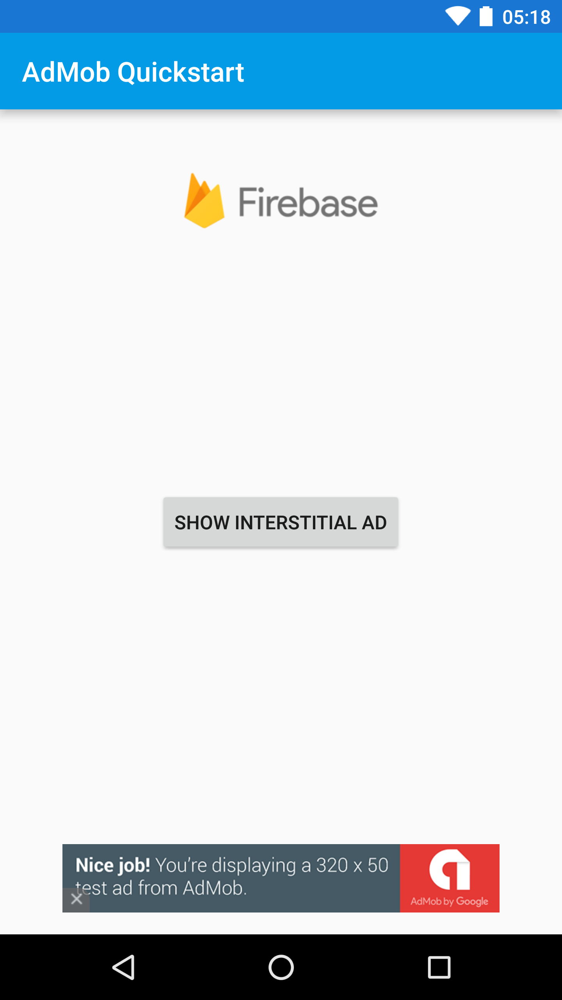

AdMob by Google Quickstart
=======================

The AdMob by Google Android quickstart demonstrates how to display an interstitial ad and
a banner ad.  AdRequest and AdView are used to display a banner ad
and InterstitialAd is used to display the interstitial ad.

Introduction
------------

- [Read more about AdMob by Google](https://firebase.google.com/docs/admob/)

Getting Started
---------------

- [Add Firebase to your Android Project](https://firebase.google.com/docs/android/setup).
- Run the sample on your Android device or emulator.
- The running sample displays a test banner ad and a test interstitial add.

Result
-----------

Support
-------

- [Stack Overflow](https://stackoverflow.com/questions/tagged/admob)
- [Developer Forum](https://groups.google.com/group/google-admob-ads-sdk)
- [Firebase Support](https://firebase.google.com/support/)

License
-------

Copyright 2016 Google, Inc.

Licensed to the Apache Software Foundation (ASF) under one or more contributor
license agreements.  See the NOTICE file distributed with this work for
additional information regarding copyright ownership.  The ASF licenses this
file to you under the Apache License, Version 2.0 (the "License"); you may not
use this file except in compliance with the License.  You may obtain a copy of
the License at

  http://www.apache.org/licenses/LICENSE-2.0

Unless required by applicable law or agreed to in writing, software
distributed under the License is distributed on an "AS IS" BASIS, WITHOUT
WARRANTIES OR CONDITIONS OF ANY KIND, either express or implied.  See the
License for the specific language governing permissions and limitations under
the License.
