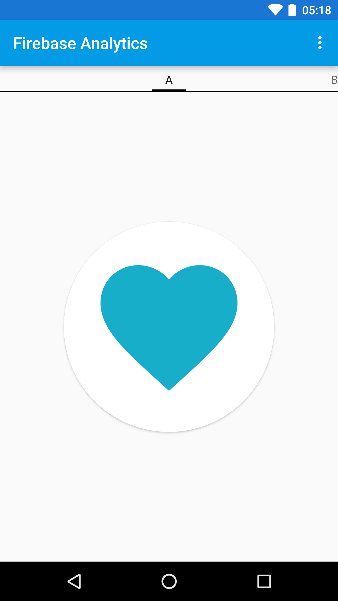

Google Analytics for Firebase Quickstart
========================================

Introduction
------------

- [Read more about Google Analytics for Firebase](https://firebase.google.com/docs/analytics)

Getting Started
---------------

- [Add Firebase to your Android Project](https://firebase.google.com/docs/android/setup).
- Run the sample on Android device or emulator.

Result
-----------
After running the app you should see a screen like this:

The first time you run the app you will be asked what your
favorite food is. This choice will be logged to Firebase
Analytics as a [User Property][user-props].

As you swipe between tabs in the app, `SELECT_CONTENT` events 
are logged to Analytics. You can see these events in
real time using [Debug View][debug-view].

Support
-------

- [Stack Overflow](https://stackoverflow.com/questions/tagged/firebase-analytics)
- [Firebase Support](https://firebase.google.com/support/)

License
-------

Copyright 2016 Google, Inc.

Licensed to the Apache Software Foundation (ASF) under one or more contributor
license agreements.  See the NOTICE file distributed with this work for
additional information regarding copyright ownership.  The ASF licenses this
file to you under the Apache License, Version 2.0 (the "License"); you may not
use this file except in compliance with the License.  You may obtain a copy of
the License at

  http://www.apache.org/licenses/LICENSE-2.0

Unless required by applicable law or agreed to in writing, software
distributed under the License is distributed on an "AS IS" BASIS, WITHOUT
WARRANTIES OR CONDITIONS OF ANY KIND, either express or implied.  See the
License for the specific language governing permissions and limitations under
the License.

[user-props]: https://firebase.google.com/docs/analytics/android/properties
[debug-view]: https://firebase.google.com/docs/analytics/debugview
