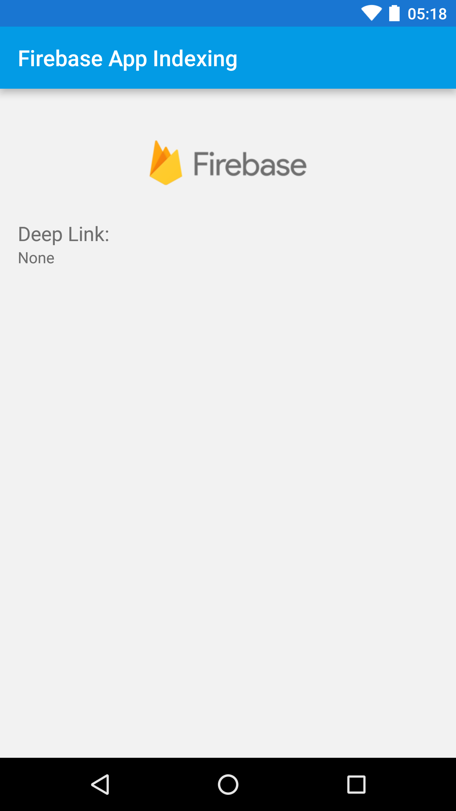

Firebase App Indexing Quickstart
==============================

The Firebase App Indexing Android quickstart demonstrates how to get your app to be found in Google Search.

Introduction
------------

- [Read more about Firebase App Indexing](https://firebase.google.com/docs/app-indexing/)

Getting Started
---------------

- [Add Firebase to your Android Project](https://firebase.google.com/docs/android/setup).
- Open the App Indexing project in Android Studio.
- Run the sample on your Android device or emulator by issuing the following command using **adb** tool:  
`adb shell am start -a android.intent.action.VIEW -d "https://www.example.com/articles/test" com.google.samples.quickstart.appindexing`
- Use ADD STICKERS and CLEAR STICKERS buttons to add and remove stickers from the index.

Result
-----------

Support
-------

- [Stack Overflow](https://stackoverflow.com/questions/tagged/android-app-indexing)
- [Firebase Support](https://firebase.google.com/support/)

License
-------

Copyright 2018 Google, Inc.

Licensed to the Apache Software Foundation (ASF) under one or more contributor
license agreements.  See the NOTICE file distributed with this work for
additional information regarding copyright ownership.  The ASF licenses this
file to you under the Apache License, Version 2.0 (the "License"); you may not
use this file except in compliance with the License.  You may obtain a copy of
the License at

  http://www.apache.org/licenses/LICENSE-2.0

Unless required by applicable law or agreed to in writing, software
distributed under the License is distributed on an "AS IS" BASIS, WITHOUT
WARRANTIES OR CONDITIONS OF ANY KIND, either express or implied.  See the
License for the specific language governing permissions and limitations under
the License.
