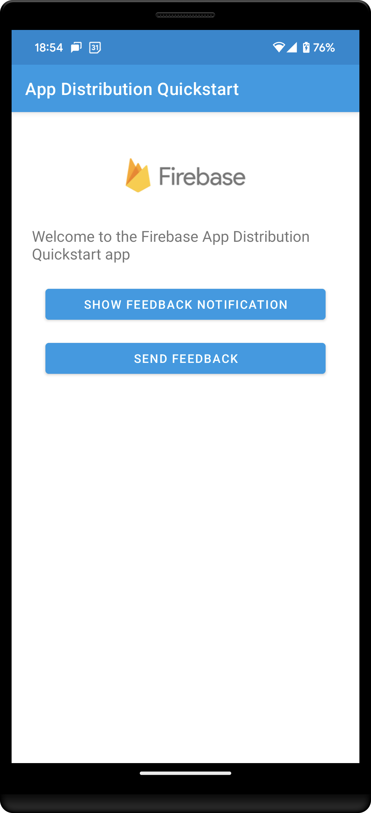

# Firebase App Distrbution Quickstart

## Introduction

The Firebase App Distribution SDK enables you to:
- display in-app alerts to your testers when new builds of your app are available to install;
- collect in-app feedback from your testers.

This quickstart aims to showcase how to use the App Distribution SDK. You can read more 
about Firebase App Distribution [here](https://firebase.google.com/docs/app-distribution)!

## Getting Started

  * Follow the instructions to [add Firebase to your Android app][add-firebase-android].

## Result

[add-firebase-android]: https://firebase.google.com/docs/android/setup
