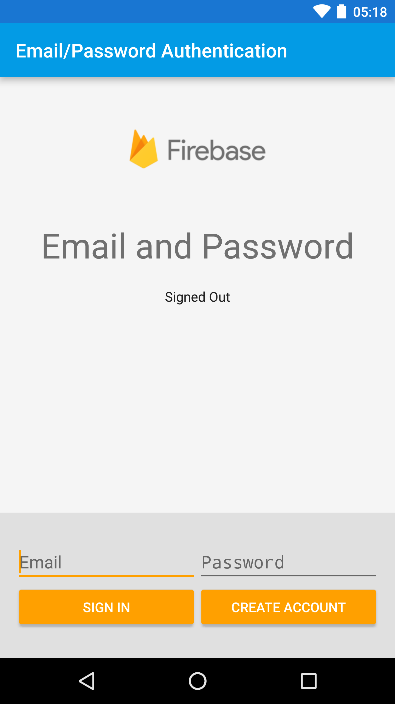

Firebase Auth Quickstart
==============================

Introduction
------------

- [Read more about Firebase Auth](https://firebase.google.com)

Getting Started
---------------

- [Add Firebase to your Android Project](https://firebase.google.com/docs/android/setup).

### Google Sign In Setup

- Go to the [Firebase Console][fir-console] and navigate to your project:
  - Select the **Auth** panel and then click the **Sign In Method** tab.
  - Click **Google** and turn on the **Enable** switch, then click **Save**.
- Run the sample app on your device or emulator.
    - Select **GoogleSignInActivity** from the main screen.
    - Click the **Sign In** button to begin.

### Facebook Login Setup

- Go to the [Facebook Developers Site](https://developers.facebook.com) and follow all
  instructions to set up a new Android app.
  - When asked for a package name, use
  `com.google.firebase.quickstart.usermanagement`.
  - When asked for a main class name,
  use `com.google.firebase.quickstart.usermanagement.FacebookLoginActivity`.
- Go to the [Firebase Console][fir-console] and navigate to your project:
  - Select the **Auth** panel and then click the **Sign In Method** tab.
  - Click **Facebook** and turn on the **Enable** switch, then click **Save**.
  - Enter your Facebook **App Id** and **App Secret** and click **Save**.
- Open the file `app/src/main/res/values/ids.xml` and replace the value of the `facebook_app_id` with the ID of the Facebook app you just created.
- Run the app on your device or emulator.
    - Select the **FacebookLoginActivity** from the main screen.
    - Click the **Sign In** button to begin.
    - If you see text that says Facebook is disabled, make sure you are running
      either the **facebookDebug** or **facebookRelease** variants of this sample.

### Email/Password Setup

- Go to the [Firebase Console][fir-console] and navigate to your project:
  - Select the **Auth** panel and then click the **Sign In Method** tab.
  - Click **Email/Password** and turn on the **Enable** switch, then click **Save**.
  - Under **Authorized Domains** click **Add Domain** and add `auth.example.com`.
- Run the app on your device or emulator.
    - Select **EmailPasswordActivity** from the main screen.
    - Fill in your desired email and password and click **Create Account** to begin.

### Passwordless Setup

- Go to the [Firebase Console][fir-console] and navigate to your project:
  - Select the **Auth** panel and then click the **Sign In Method** tab.
  - Click **Email/Password** and turn on the **Enable** switch. 
  - Turn on the **Email Link (passwordless sign-in)** switch, then click **Save**.
- Replace your-project-id in the AndroidManifest.xml file with your project ID.
- Run the app on your device or emulator.
    - Select **PasswordlessActivity** from the main screen.
    - Fill in your desired email and click **Send Link** to begin.

### Phone Authentication Setup

- Go to the [Firebase Console][fir-console] and navigate to your project:
  - Select the **Auth** panel and then click the **Sign In Method** tab.
  - Click **Phone** and turn on the **Enable** switch, then click **Save**.
- Run the app on your device or emulator.
    - Select **PhoneAuthActivity** from the main screen.
    - Enter your phone numeber and click **Verify** to begin.

### Custom Authentication Setup

- Go to the [Google Developers Console](https://console.developers.google.com/project) and navigate to your project:
    - Click on the **Service accounts** tab in the left.
    - Click on the **Create Service Account** on the top.
    - Enter desired service account name and click on the **Create** button.
    - Once the serivce account is created, click on the **Options**.
    - Choose **JSON** as the key type then click on the **Create** button.
    - You should now have a new JSON file for your service account in your Downloads directory.
- Open the file `web/auth.html` using your web browser.
    - Click **Choose File** and upload the JSON file you just downloaded.
    - Enter any User ID and click **Generate**.
    - Copy the text from the **ADB Command** section. This will be required later on.
- Run the Android application on your Android device or emulator.
    - Select **CustomAuthActivity** from the main screen.
    - Run the text copied from the **ADB Command** section of the web page in the steps above. This will update the Custom Token field of the running app.
    - Click **Sign In** to sign in to Firebase User Management with the generated JWT. You should
      see the User ID you entered when generating the token.

### Generic OAuth Sign In (Microsoft, Apple, Yahoo, Twitter, etc)

#### Microsoft

- Follow the [instructions](https://firebase.google.com/docs/auth/android/microsoft-oauth#before_you_begin)
  to enable Microsoft authentication in the Firebase console.
- Run the Android application on your Android device or emulator.
    - Select **GenericIdpActivity** from the main screen.
    - Select **Microsoft** in the dropdown.
    - Hit the sign in button and proceed through the login flow.

#### Apple

- Follow the [instructions](https://firebase.google.com/docs/auth/android/apple-oauth#before_you_begin)
  to enable Apple authentication in the Firebase console.
- Run the Android application on your Android device or emulator.
    - Select **GenericIdpActivity** from the main screen.
    - Select **Apple** in the dropdown.
    - Hit the sign in button and proceed through the login flow.

#### Yahoo

- Follow the [instructions](https://firebase.google.com/docs/auth/android/yahoo-oauth#before_you_begin)
  to enable Yahoo authentication in the Firebase console.
- Run the Android application on your Android device or emulator.
    - Select **GenericIdpActivity** from the main screen.
    - Select **Yahoo** in the dropdown.
    - Hit the sign in button and proceed through the login flow.

#### Twitter

- Follow the [instructions](https://firebase.google.com/docs/auth/android/twitter-login#before_you_begin)
  to enable Twitter authentication in the Firebase console.
- Run the Android application on your Android device or emulator.
    - Select **GenericIdpActivity** from the main screen.
    - Select **Twitter** in the dropdown.
    - Hit the sign in button and proceed through the login flow.

Result
-----------

Support
-------

- [Stack Overflow](https://stackoverflow.com/questions/tagged/firebase-authentication)
- [Firebase Support](https://firebase.google.com/support/)

License
-------

Copyright 2016 Google, Inc.

Licensed to the Apache Software Foundation (ASF) under one or more contributor
license agreements.  See the NOTICE file distributed with this work for
additional information regarding copyright ownership.  The ASF licenses this
file to you under the Apache License, Version 2.0 (the "License"); you may not
use this file except in compliance with the License.  You may obtain a copy of
the License at

  http://www.apache.org/licenses/LICENSE-2.0

Unless required by applicable law or agreed to in writing, software
distributed under the License is distributed on an "AS IS" BASIS, WITHOUT
WARRANTIES OR CONDITIONS OF ANY KIND, either express or implied.  See the
License for the specific language governing permissions and limitations under
the License.

[fir-console]: https://console.firebase.google.com
