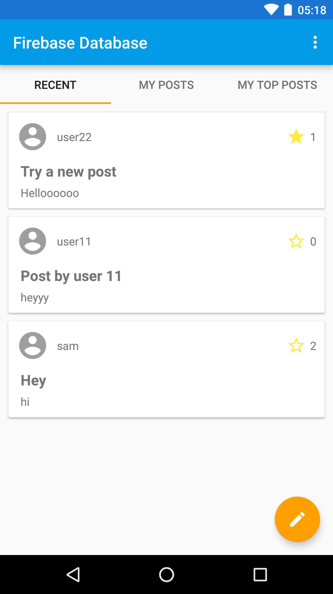

Firebase Database Quickstart
=============================

Introduction
------------

- [Read more about Firebase Database](https://firebase.google.com/docs/database)

Getting Started
---------------

- [Add Firebase to your Android Project](https://firebase.google.com/docs/android/setup).
- Log in to the [Firebase Console](https://console.firebase.google.com).
- Go to **Auth** tab and enable **Email/Password** authentication.
- Run the sample on Android device or emulator.

Result
-----------



Data Model
-----------
This quickstart demonstrates a simple data model for a social application.
While this data model uses some of the Firebase best practices, it has some
known tradeoffs made for simplicity that would not scale to very large numbers
of users.

The database has four "root" nodes:

  * `users` - a list of `User` objects, keyed by user ID. So
    `/users/<ID>/email` is the email address of the user with id=`<ID>`.
  * `posts` - a list of `Post` objects, keyed by randomly generated push ID.
    Each `Post` contains the `uid` and `author` properties to determine the
    identity of the author without a JOIN-style query.
    * Posts contain a `stars` property which is a `Map` of user IDs to boolean
      values.  If `/posts/<POST-ID>/stars/<USER-ID>` is `true`, this means
      the user with ID `<USER-ID>` has starred the post with ID `<POST-ID>`.
      This data nesting makes it easy to tell if a specific user has already
      starred a specific post, but would not scale to large numbers of stars
      per post as it would make loading the Post data more expensive.
  * `user-posts` - a list of posts by the user.  `/user-posts/<USER-ID>` is a list
     of all posts made by a specific user, keyed by the same push ID used in
     the `posts` tree. This makes it easy to query "all posts by a specific
     user" without filtering through all Post objects.
  * `post-comments` - comments on a particular posts, where
    `/post-comments/<POST-ID>` is a list of all comments on post with id
    `<POST-ID>`.  Each comment has a randomly generated push key. By keeping
    this data in its own tree rather than nesting it under `posts`, we make it
    possible to load a post without loading all comments while still
    having a known path to access all comments for a particular post.

Database Rules
---------------
Below are some samples rules that limit access and validate data:

```javascript

{
  "rules": {
    // User profiles are only readable/writable by the user who owns it
    "users": {
      "$UID": {
        ".read": "auth.uid == $UID",
        ".write": "auth.uid == $UID"
      }
    },

    // Posts can be read by anyone but only written by logged-in users.
    "posts": {
      ".read": true,
      ".write": "auth.uid != null",

      "$POSTID": {
        // UID must match logged in user and is fixed once set
        "uid": {
          ".validate": "(data.exists() && data.val() == newData.val()) || newData.val() == auth.uid"
        },

        // User can only update own stars
        "stars": {
          "$UID": {
              ".validate": "auth.uid == $UID"
          }
        }
      }
    },

    // User posts can be read by anyone but only written by the user that owns it,
    // and with a matching UID
    "user-posts": {
      ".read": true,

      "$UID": {
        "$POSTID": {
          ".write": "auth.uid == $UID",
        	".validate": "data.exists() || newData.child('uid').val() == auth.uid"
        }
      }
    },


    // Comments can be read by anyone but only written by a logged in user
    "post-comments": {
      ".read": true,
      ".write": "auth.uid != null",

      "$POSTID": {
        "$COMMENTID": {
          // UID must match logged in user and is fixed once set
          "uid": {
              ".validate": "(data.exists() && data.val() == newData.val()) || newData.val() == auth.uid"
          }
        }
      }
    }
  }
}
```


Support
-------

- [Stack Overflow](https://stackoverflow.com/questions/tagged/firebase-database)
- [Firebase Support](https://firebase.google.com/support/)


License
-------

Copyright 2016 Google, Inc.

Licensed to the Apache Software Foundation (ASF) under one or more contributor
license agreements.  See the NOTICE file distributed with this work for
additional information regarding copyright ownership.  The ASF licenses this
file to you under the Apache License, Version 2.0 (the "License"); you may not
use this file except in compliance with the License.  You may obtain a copy of
the License at

  http://www.apache.org/licenses/LICENSE-2.0

Unless required by applicable law or agreed to in writing, software
distributed under the License is distributed on an "AS IS" BASIS, WITHOUT
WARRANTIES OR CONDITIONS OF ANY KIND, either express or implied.  See the
License for the specific language governing permissions and limitations under
the License.
