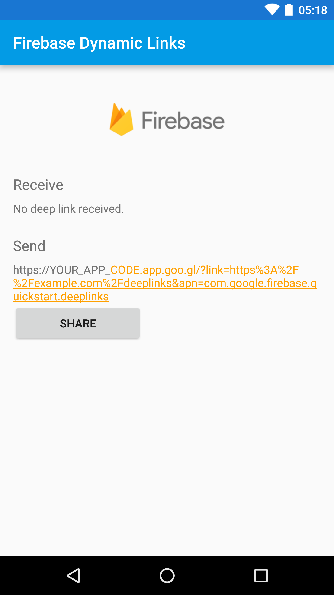

Firebase Dynamic Links Quickstart
==============================

Introduction
------------

- [Read more about Firebase Dynamic Links](https://firebase.google.com/docs/dynamic-links)

Getting Started
---------------

- [Add Firebase to your Android Project](https://firebase.google.com/docs/android/setup).
- Follow the [quickstart guide](https://firebase.google.com/docs/android/setup) to set up your project.
- Configure the sample:
  - Replace the `app_code` value in `app/build.gradle` with your personal
    [app code](https://firebase.google.com/docs/dynamic-links/android/create#set-up-firebase-and-the-dynamic-links-sdk).
  - Replace the **applicationId** in `app/build.gradle` with the package name that matches your app code.
- Run the sample on your Android device or emulator.
- Using the sample:
  - When the application is started, a deep link will be generated using your app code.
  - Click **Share**
    to share this deep link to another application.
  - The application checks if it was launched from a deep link. If so, the link data will be displayed under the **Receive** heading.
  - Try sharing the deep link from the application and use that deep link to re-launch the application.

Result
-----------

Support
-------

- [Stack Overflow](https://stackoverflow.com/questions/tagged/firebase-dynamic-links)
- [Firebase Support](https://firebase.google.com/support/)

License
-------

Copyright 2016 Google, Inc.

Licensed to the Apache Software Foundation (ASF) under one or more contributor
license agreements.  See the NOTICE file distributed with this work for
additional information regarding copyright ownership.  The ASF licenses this
file to you under the Apache License, Version 2.0 (the "License"); you may not
use this file except in compliance with the License.  You may obtain a copy of
the License at

  http://www.apache.org/licenses/LICENSE-2.0

Unless required by applicable law or agreed to in writing, software
distributed under the License is distributed on an "AS IS" BASIS, WITHOUT
WARRANTIES OR CONDITIONS OF ANY KIND, either express or implied.  See the
License for the specific language governing permissions and limitations under
the License.
