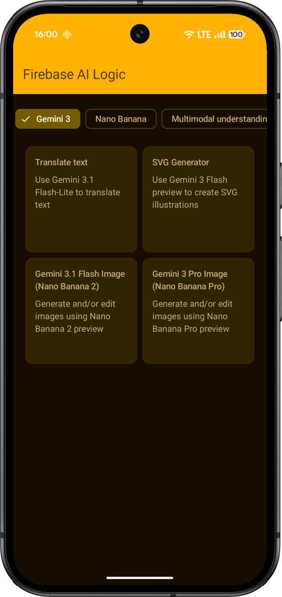

# Firebase AI Logic quickstart sample app

This Android sample app demonstrates how to use state-of-the-art
generative AI models (like Gemini) to build AI-powered features and applications.

For more information about Firebase AI Logic, visit the [documentation](http://firebase.google.com/docs/ai-logic).

## Setup & Configuration

### Prerequisites
*   **Google AI (Gemini) API Key**: Most samples work out of the box with the Google AI SDK.
*   **Vertex AI**: Samples marked with *(Vertex AI)* require you to enable the Vertex AI API in your Google Cloud project and have your files in Cloud Storage.
*   **Server Prompt Templates**: These samples require you to set up templates in the [Firebase Console](https://console.firebase.google.com/project/_/ai-logic).

## Getting Started

To try out this sample app, you need to use latest stable version of Android Studio.

* [Set up your Android app for Firebase][setup-android]
  * Use the package name `com.google.firebase.quickstart.ai`
* [Set up Firebase AI Logic][setup-ai-logic]
* Run the app on an Android device or emulator.

## Features

You can find the implementation for each feature by clicking on the links below:

### Gemini 3
- [Translate text](app/src/main/java/com/google/firebase/quickstart/ai/feature/text/TranslationViewModel.kt): Use Gemini 3.1 Flash-Lite to translate text
- [SVG Generator](app/src/main/java/com/google/firebase/quickstart/ai/feature/text/SvgViewModel.kt): Use Gemini 3.5 Flash to create SVG illustrations
- [Gemini 3.1 Flash Image (Nano Banana 2)](app/src/main/java/com/google/firebase/quickstart/ai/feature/text/NanoBanana2ViewModel.kt): Generate and/or edit images using Nano Banana 2 preview
- [Gemini 3 Pro Image (Nano Banana Pro)](app/src/main/java/com/google/firebase/quickstart/ai/feature/text/NanoBananaProViewModel.kt): Generate and/or edit images using Nano Banana Pro preview

### Nano Banana
- [Gemini 3.1 Flash Image (Nano Banana 2)](app/src/main/java/com/google/firebase/quickstart/ai/feature/text/NanoBanana2ViewModel.kt): Generate and/or edit images using Nano Banana 2 preview
- [Gemini 3 Pro Image (Nano Banana Pro)](app/src/main/java/com/google/firebase/quickstart/ai/feature/text/NanoBananaProViewModel.kt): Generate and/or edit images using Nano Banana Pro preview
- [Gemini 2.5 Flash Image (Nano Banana)](app/src/main/java/com/google/firebase/quickstart/ai/feature/text/NanoBananaViewModel.kt): Generate and/or edit images using Nano Banana (GA)

### Multimodal understanding
- [Audio Summarization](app/src/main/java/com/google/firebase/quickstart/ai/feature/text/AudioSummarizationViewModel.kt): Use Gemini 3.1 Flash Lite to summarize an audio file
- [Summarize video](app/src/main/java/com/google/firebase/quickstart/ai/feature/text/VideoSummarizationViewModel.kt): Summarize a video and extract important dialogue.
- [Translation from audio (Vertex AI)](app/src/main/java/com/google/firebase/quickstart/ai/feature/text/AudioTranslationViewModel.kt): Translate an audio file stored in Cloud Storage
- [Blog post creator (Vertex AI)](app/src/main/java/com/google/firebase/quickstart/ai/feature/text/ImageBlogCreatorViewModel.kt): Create a blog post from an image file stored in Cloud Storage.
- [Document comparison (Vertex AI)](app/src/main/java/com/google/firebase/quickstart/ai/feature/text/DocumentComparisonViewModel.kt): Compare the contents of 2 documents stored in Cloud Storage.
- [Hashtags for a video (Vertex AI)](app/src/main/java/com/google/firebase/quickstart/ai/feature/text/VideoHashtagGeneratorViewModel.kt): Generate hashtags for a video ad stored in Cloud Storage

### Tools and function calling
- [Grounding with Google Search](app/src/main/java/com/google/firebase/quickstart/ai/feature/text/GoogleSearchGroundingViewModel.kt): Use Grounding with Google Search to get responses based on up-to-date information from the web.
- [Manual function calling](app/src/main/java/com/google/firebase/quickstart/ai/feature/text/WeatherChatViewModel.kt): Use function calling to get the weather conditions for a specific US city on a specific date.
- [Automatic function calling](app/src/main/java/com/google/firebase/quickstart/ai/feature/text/AutoFunctionCallViewModel.kt): Use automatic function calling to get the weather conditions for a specific US city on a specific date.
- [Gemini Live (audio input)](app/src/main/java/com/google/firebase/quickstart/ai/feature/live/StreamAudioViewModel.kt): Use bidirectional streaming to get information about weather conditions for a specific US city on a specific date
- [Gemini Live (video input)](app/src/main/java/com/google/firebase/quickstart/ai/feature/live/StreamVideoViewModel.kt): Use bidirectional streaming to chat with Gemini using your phone's camera

### Live API streaming
- [Gemini 3.1 Flash Live preview (audio input)](app/src/main/java/com/google/firebase/quickstart/ai/feature/live/StreamAudioViewModel.kt): Use bidirectional streaming to get information about weather conditions for a specific US city on a specific date
- [Gemini 3.1 Flash Live preview (video input)](app/src/main/java/com/google/firebase/quickstart/ai/feature/live/StreamVideoViewModel.kt): Use bidirectional streaming to chat with Gemini using your phone's camera

### Server prompt templates
- [Server Prompt Templates - Gemini](app/src/main/java/com/google/firebase/quickstart/ai/feature/text/ServerPromptTemplateViewModel.kt): Generate an invoice using server prompt templates.

### Hybrid inference
- [Hybrid Receipt Scanner](app/src/main/java/com/google/firebase/quickstart/ai/feature/hybrid/HybridInferenceViewModel.kt): Use hybrid inference to scan receipts and extract expense data on-device whenever possible.

## All samples

The full list of available samples can be found in the
[FirebaseAISamples.kt file](app/src/main/java/com/google/firebase/quickstart/ai/ui/navigation/FirebaseAISamples.kt).

[setup-android]: https://firebase.google.com/docs/android/setup
[setup-ai-logic]: https://firebase.google.com/docs/ai-logic/get-started?api=dev#set-up-firebase