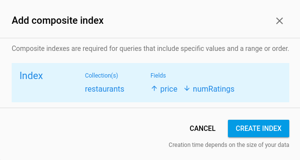

# Cloud Firestore Quickstart

## Introduction

Fire Eats is a restaurant recommendation app built on Cloud Firestore.
For more information about Firestore visit [the docs][firestore-docs].

## Getting Started

  * [Set up your Android app for Cloud Firestore][setup-android]
    * Use the package name `com.google.firebase.example.fireeats`
  * In the Authentication tab of the Firebase console go to the 
    [Sign-in Method][auth-providers] page and enable 'Email/Password'.
    * This app uses [FirebaseUI][firebaseui] for authentication.
  * Run the app on an Android device or emulator.
    
### Security Rules

Add the following security rules to your project in the:
[rules tab](https://console.firebase.google.com/project/_/database/firestore/rules):

```
service cloud.firestore {  
  match /databases/{database}/documents {
    // Anyone can read a restaurant, only authorized
    // users can create or update. Deletes are not allowed.
  	 match /restaurants/{restaurantId} {
    	 allow read: if true;
    	 allow create, update: if request.auth.uid != null;
    }
    
    // Anyone can read a rating. Only the user who made the rating
    // can delete it. Ratings can never be updated.
    match /restaurants/{restaurantId}/ratings/{ratingId} {
    	 allow read: if true;
      allow create: if request.auth.uid != null;
    	 allow delete: if request.resource.data.userId == request.auth.uid;
    	 allow update: if false;
    }
  }
}
```

### Run the App

  * When you open the app you will be prompted to sign in, choose
    any email and password.
  * When you first open the app it will be empty, choose
    **Add Random Items** from the overflow menu to add some
    new entries.
    
### Result


### Indexes

As you use the app's filter functionality you may see warnings
in logcat that look like this:

```
com.google.firebase.example.fireeats W/Firestore Adapter: onEvent:error
com.google.firebase.firestore.FirebaseFirestoreException: FAILED_PRECONDITION: The query requires an index. You can create it here: https://console.firebase.google.com/project/...
```

This is because indexes are required for most compound queries in
Cloud Firestore. Clicking on the link from the error message will
automatically open the index creation UI in the Firebase console
with the correct paramters filled in:



This app also provides an index specification file in `indexes.json`
which specifies all indexes required to run the application. You can
add all of these indexes programatically using the [Firebase CLI][firebase-cli].

[firestore-docs]: https://firebase.google.com/docs/firestore/
[setup-android]: https://firebase.google.com/docs/firestore/client/setup-android
[auth-providers]: https://console.firebase.google.com/project/_/authentication/providers
[firebaseui]: https://github.com/firebase/FirebaseUI-Android
[firebase-cli]: https://firebase.google.com/docs/firestore/query-data/indexing#use_the_firebase_cli
