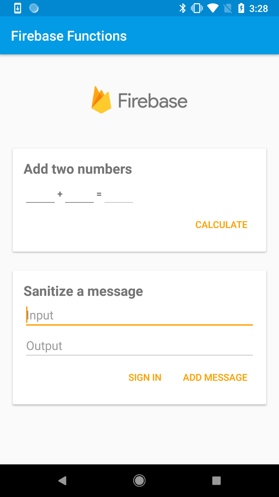

Firebase Functions Quickstart
=============================

Introduction
------------

This quickstart demontstrates **Callable Functions** which are HTTPS Cloud Functions
that can be invoked directly from your mobile application.

- [Read more about callable functions](https://firebase.google.com/docs/functions/callable)

Getting Started
---------------

- [Add Firebase to your Android Project](https://firebase.google.com/docs/android/setup).
- Deploy the provided cloud functions:

  ```bash
  # Move to the `functions` subdirectory of quickstart-android
  cd functions

  # Install all of the dependencies of the cloud functions
  cd functions
  npm install
  cd ../

  # Deploy functions to your Firebase project
  firebase --project=YOUR_PROJECT_ID deploy --only functions
  ```

- Run the sample on Android device or emulator.

Screenshots
-----------


Support
-------

- [Stack Overflow](https://stackoverflow.com/questions/tagged/firebase-crash-reporting)
- [Firebase Support](https://firebase.google.com/support/)

License
-------

Copyright 2018 Google, Inc.

Licensed to the Apache Software Foundation (ASF) under one or more contributor
license agreements.  See the NOTICE file distributed with this work for
additional information regarding copyright ownership.  The ASF licenses this
file to you under the Apache License, Version 2.0 (the "License"); you may not
use this file except in compliance with the License.  You may obtain a copy of
the License at

  http://www.apache.org/licenses/LICENSE-2.0

Unless required by applicable law or agreed to in writing, software
distributed under the License is distributed on an "AS IS" BASIS, WITHOUT
WARRANTIES OR CONDITIONS OF ANY KIND, either express or implied.  See the
License for the specific language governing permissions and limitations under
the License.
