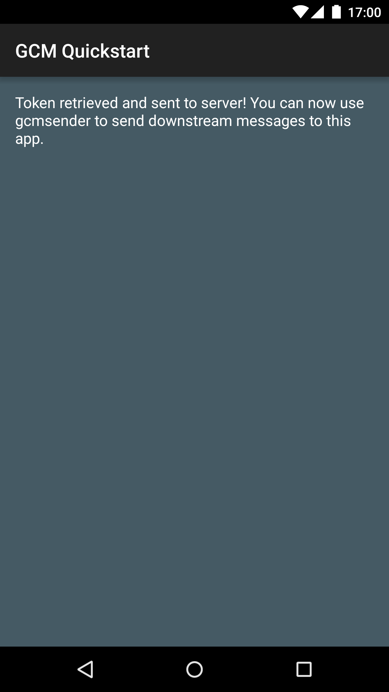

Google Cloud Messaging Quickstart
=================================

Google Cloud Messaging Android Quickstart app demonstrates registering
an Android app for GCM and handling the receipt of a GCM message.
InstanceID allows easy registration while GcmReceiver and
GcmListenerService provide simple means of receiving and handling
messages.

Introduction
------------

- [Read more about Google Cloud Messaging](https://developers.google.com/cloud-messaging/)

Getting Started
---------------

- Follow the [quickstart guide](https://developers.google.com/cloud-messaging/)
  to set up your project in Android Studio.
- Run the sample on your Android device.
- Update API_KEY in GcmSender.java, with API key from your project.
- Run the terminal command to send GCM message to your device.
- A notification containing the GCM message should be displayed on the
  device.

Screenshots
-----------

Support
-------

- Stack Overflow: http://stackoverflow.com/questions/tagged/google-cloud-messaging

If you've found an error in this sample, please file an issue:
https://github.com/googlesamples/google-services/issues

Patches are encouraged, and may be submitted by forking this project and
submitting a pull request through GitHub.

License
-------

Copyright 2015 Google, Inc.

Licensed to the Apache Software Foundation (ASF) under one or more contributor
license agreements.  See the NOTICE file distributed with this work for
additional information regarding copyright ownership.  The ASF licenses this
file to you under the Apache License, Version 2.0 (the "License"); you may not
use this file except in compliance with the License.  You may obtain a copy of
the License at

  http://www.apache.org/licenses/LICENSE-2.0

Unless required by applicable law or agreed to in writing, software
distributed under the License is distributed on an "AS IS" BASIS, WITHOUT
WARRANTIES OR CONDITIONS OF ANY KIND, either express or implied.  See the
License for the specific language governing permissions and limitations under
the License.
