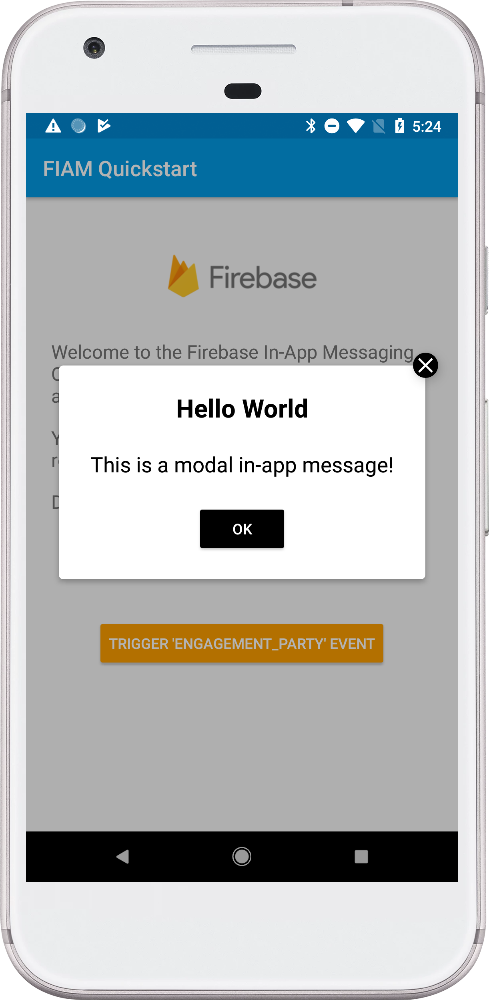

# Firebase In-App Messaging Quickstart

## Introduction

This quickstart demonstrates basic usage of Firebase In-App Messaging.

## Getting Started

  * Follow the instructions to [add Firebase to your Android app][add-firebase-android].
  * In the Firebase console, navigate to the **In-App Messaging** section.
  * Click **New Campaign**
    * In the **Style and content** section, design a campaign using one of the provided layouts (Modal, Image, or Banner),
      then click **Next**.
    * In the **Target** section, enter any campain name and description. In the dropdown, choose to target the app
      you just created, then click **Next**.
    * In the **Scheduling** section, choose any reasonable start and end date. Choose `engagement_party` for the trigger event,
      then click **Next**.
    * In the **Conversion events** tab choose the `ecommerce_purchase` conversion event.
  * **Run** the sample app on your device
    * Press the **Trigger** button to fire the event.

## Result

If you successfully trigger a message, you should see something like this:

[add-firebase-android]: https://firebase.google.com/docs/android/setup