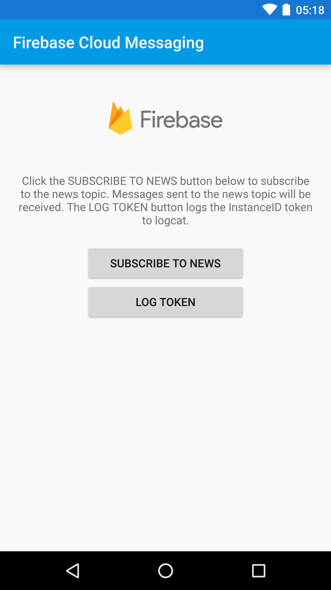

Firebase Cloud Messaging Quickstart
==============================

The Firebase Cloud Messaging Android Quickstart app demonstrates registering
an Android app for Notifications and handling the receipt of a message.
InstanceID allows easy registration while FirebaseMessagingService and FirebaseInstanceIDService
enable token refreshes and message handling on the client.

Introduction
------------

- [Read more about Firebase Cloud Messaging](https://firebase.google.com/docs/cloud-messaging)

Getting Started
---------------

- [Add Firebase to your Android Project](https://firebase.google.com/docs/android/setup).
- Run the sample on Android device or emulator.

Sending Notifications
---------------------

Use Firebase console to send FCM messages to device or emulator.

## Send to a single device

- From Firebase console Notification section, click New Message.
- Enter the text of your message in the Message Text field.
- Set the target to Single Device.
- Check the logs for the InstanceID token, copy and paste it into the Firebase console Token field.
  If you cannot find the token in your logs, hit the LOG TOKEN button in the app and the token will
  be logged in logcat.
- Click Send Message.
- If your application is in the foreground you should see the incoming
  message printed in the logs. If it is in the background, a system notification should be
  displayed, and when tapped should return to the quickstart app.

## Send to a topic

- From Firebase console Notification section, click New Message.
- Enter the text of your message in the Message Text field.
- Hit the SUBSCRIBE TO NEWS button to subscribe to the news topic.
- Set the target to Topic.
- Select the news topic from the list of topics. You must subscribe from the device or emulator
  before the topic will will be visible in the console.
- Click Send Message.
- If your application is in the foreground you should see the incoming
  message printed in the logs. If it is in the background, a system notification should be
  displayed, and when tapped should return to the quickstart app.

Screenshots
-----------

Support
-------

https://firebase.google.com/support/

License
-------

Copyright 2016 Google, Inc.

Licensed to the Apache Software Foundation (ASF) under one or more contributor
license agreements.  See the NOTICE file distributed with this work for
additional information regarding copyright ownership.  The ASF licenses this
file to you under the Apache License, Version 2.0 (the "License"); you may not
use this file except in compliance with the License.  You may obtain a copy of
the License at

  http://www.apache.org/licenses/LICENSE-2.0

Unless required by applicable law or agreed to in writing, software
distributed under the License is distributed on an "AS IS" BASIS, WITHOUT
WARRANTIES OR CONDITIONS OF ANY KIND, either express or implied.  See the
License for the specific language governing permissions and limitations under
the License.
