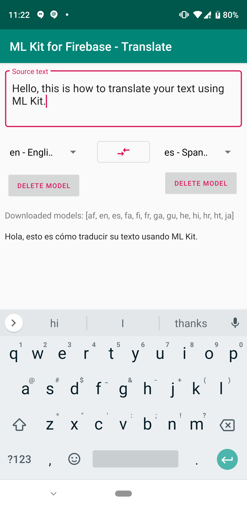

ML Kit Translate for Firebase Quickstart
==============================

The ML Kit Translate for Firebase Android Quickstart app demonstrates how to
use the Translate feature of ML Kit to perform translations of text in
your application.

Introduction
------------

- [Read more about ML Kit Translate for Firebase](https://firebase.google.com/docs/ml-kit/android/translate-text)

Getting Started
---------------

- [Add Firebase to your Android Project](https://firebase.google.com/docs/android/setup).
- Run the sample on an Android device.
- Choose the Java or Kotlin version on the initial screen.
- Type input text and press the buttons to identify languages.

Result
-----------

Support
-------

- [Stack Overflow](https://stackoverflow.com/questions/tagged/firebase-mlkit)
- [Firebase Support](https://firebase.google.com/support/).

License
-------

Copyright 2019 Google, Inc.

Licensed to the Apache Software Foundation (ASF) under one or more contributor
license agreements.  See the NOTICE file distributed with this work for
additional information regarding copyright ownership.  The ASF licenses this
file to you under the Apache License, Version 2.0 (the "License"); you may not
use this file except in compliance with the License.  You may obtain a copy of
the License at

  http://www.apache.org/licenses/LICENSE-2.0

Unless required by applicable law or agreed to in writing, software
distributed under the License is distributed on an "AS IS" BASIS, WITHOUT
WARRANTIES OR CONDITIONS OF ANY KIND, either express or implied.  See the
License for the specific language governing permissions and limitations under
the License.
