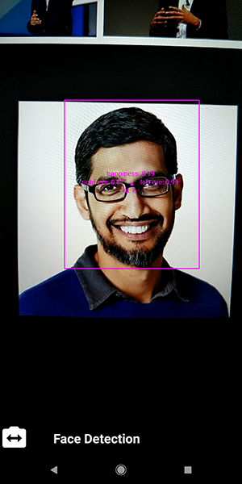

ML Kit for Firebase Quickstart
==============================

The ML Kit for Firebase Android Quickstart app demonstrates how to use the
various features of ML Kit to add machine learning to your application.

Introduction
------------

- [Read more about ML Kit for Firebase](https://firebase.google.com/docs/ml-kit/)

Getting Started
---------------

- [Add Firebase to your Android Project](https://firebase.google.com/docs/android/setup).
- Run the sample on an Android device.
- Choose LivePreviewActivity to see a demo of the following APIs:
  - Face detection
  - Text recognition (on-device)
  - Barcode scanning
  - Image labeling (on-device)
  - Landmark recognition
  - Custom model (Labeled "Classification"). The custom model used in this
    sample, MobileNet_v1, is already included as a local asset in the project.
    To use this sample with a hosted model, follow the directions under the
    "Hosting a Custom Model" section of this readme.
- Choose StillImageActivity to see a demo of the following:
  - Image labeling (Cloud)
  - Landmark recognition (Cloud)
  - Text recognition (Cloud)
  - Document text recognition (Cloud)

Result
-----------

Hosting a Custom Model
-----------
- [Download](http://download.tensorflow.org/models/mobilenet_v1_2018_02_22/mobilenet_v1_1.0_224_quant.tgz)
  the TensorFlow Lite custom model we are using in this sample.
- Go to the Firebase console.
- Select your project.
- Select ML Kit under the DEVELOP section in the left hand navigation.
- Click on the CUSTOM tab.
- Click on Add another model and use "mobilenet_v1" as the name.
- Click BROWSE and upload the mobilenet_v1_1.0_224_quant.tflite file you
  downloaded earlier.
- Click PUBLISH.

Support
-------

- [Stack Overflow](https://stackoverflow.com/questions/tagged/firebase-mlkit)
- [Firebase Support](https://firebase.google.com/support/).

License
-------

Copyright 2018 Google, Inc.

Licensed to the Apache Software Foundation (ASF) under one or more contributor
license agreements.  See the NOTICE file distributed with this work for
additional information regarding copyright ownership.  The ASF licenses this
file to you under the Apache License, Version 2.0 (the "License"); you may not
use this file except in compliance with the License.  You may obtain a copy of
the License at

  http://www.apache.org/licenses/LICENSE-2.0

Unless required by applicable law or agreed to in writing, software
distributed under the License is distributed on an "AS IS" BASIS, WITHOUT
WARRANTIES OR CONDITIONS OF ANY KIND, either express or implied.  See the
License for the specific language governing permissions and limitations under
the License.
