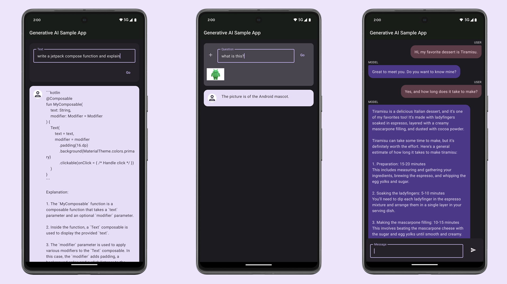

# Firebase Vertex AI Sample for Android (Kotlin)

This Android sample app demonstrates how to use state-of-the-art
generative AI models (like Gemini) to build AI-powered features and applications.

To try out this sample app, you need to use latest stable version of Android Studio.
However, if you want to latest lint checks and AI productivity features in Android
Studio use the latest preview version of [Android Studio](https://developer.android.com/studio/preview).

You can clone this repository or import the project from Android Studio following the steps
[here](https://developer.android.com/jetpack/compose/setup#sample).

## Screenshots

## Requirements

TODO

## Features

This sample showcases the following API capablilites:
* Generate Text - demonstrates the Text feature from the SDK
* Photo Reasoning - demonstrates the MultiModal feature from the SDK
* Chat - demonstrates the Multi-turn Conversations feature from the SDK

## Documentation

TODO
